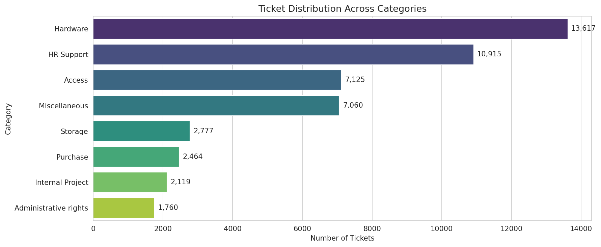
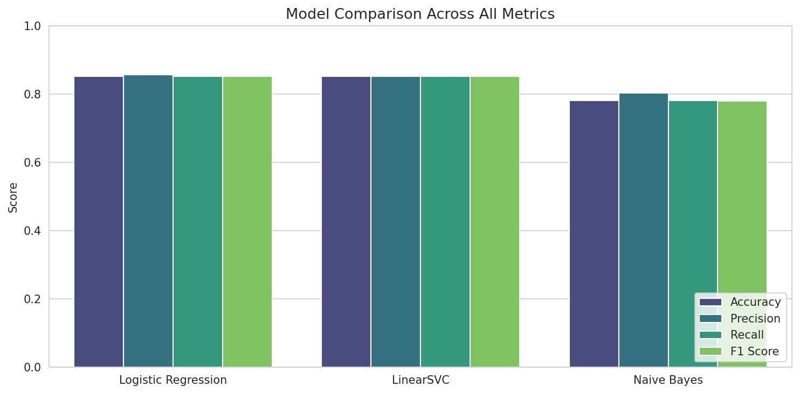
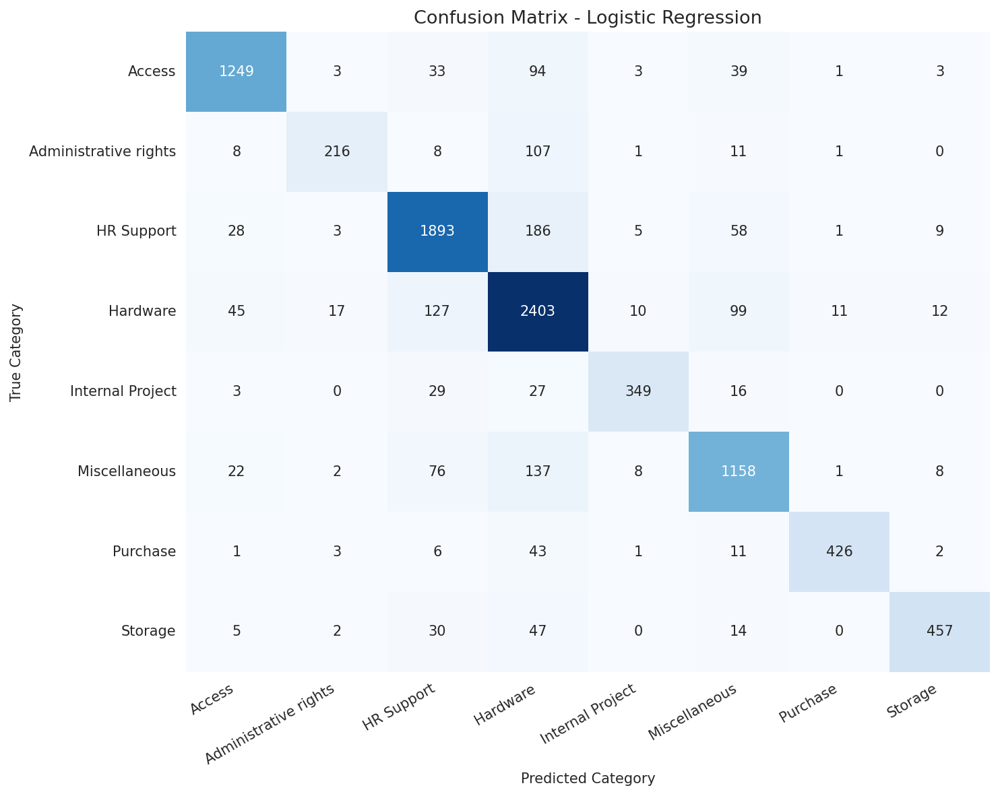
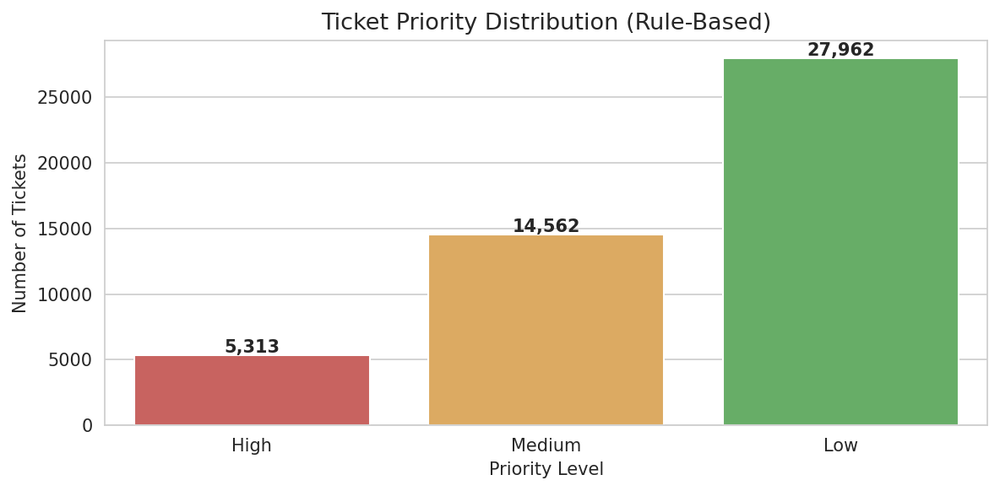

# Support Ticket Classification & Prioritization

> **Machine Learning Internship - Task 2** | Future Interns (Track: ML)

A machine learning project that reads customer support tickets, automatically
classifies them by category, and tags each one with a priority level - turning
a flood of raw tickets into a routed, prioritized queue a support team can
actually work through.

---

## Author

**Rohit Kumar Malik** - AI & Cybersecurity Graduate

[LinkedIn](https://www.linkedin.com/in/rohitmalik7) · [GitHub](https://github.com/RohitMalik7) · rohitmalik180904@gmail.com

---

## Overview

Real support teams lose hours every day just *sorting* tickets - figuring out
what kind of issue each one is, and how urgent it is. This project builds an
ML-powered decision-support system that does both jobs automatically:

- a **category classifier** trained on 47,837 real IT helpdesk tickets,
- a **transparent rule-based priority tagger** that flags High / Medium / Low
  by scanning the ticket text for urgency signals.

The best classifier (Logistic Regression + TF-IDF) reaches **~85.2% weighted
F1**, with the combined system producing live `(category, priority)` predictions
for any new ticket.

---

## Dataset

| Property | Detail |
|----------|--------|
| Source | IT Service Ticket Classification Dataset (Kaggle - adisongoh) |
| Records | 47,837 tickets |
| Columns | 2 - `Document` (ticket text), `Topic_group` (category) |
| Categories | 8 - Hardware, HR Support, Access, Miscellaneous, Storage, Purchase, Internal Project, Administrative rights |
| Domain | Internal IT helpdesk |
| Data Quality | No missing values |

The dataset does not include priority labels, so priority is derived from the
ticket text using a rule-based urgency scoring system.

---

## Approach

1. **Text cleaning** - lowercase, remove punctuation/digits/URLs, remove
   stopwords, lemmatize (NLTK).
2. **EDA** - category distribution, ticket-length distribution, and the most
   common words per category (proves each category has its own vocabulary).
3. **Feature extraction** - TF-IDF with unigrams + bigrams, capped at 5,000
   features.
4. **Label encoding** - `LabelEncoder` for the 8 categories.
5. **Stratified train/test split** - 80/20, preserving class proportions.
6. **Models** - trained and compared Logistic Regression, LinearSVC, and
   Multinomial Naive Bayes.
7. **Evaluation** - accuracy, precision, recall, F1, classification report,
   and a confusion matrix on the best model.
8. **Priority system** - keyword-tier rule-based tagger (High / Medium / Low).
9. **Live demo** - end-to-end function that classifies and prioritizes new,
   unseen ticket texts.

---

## Results

Weighted metrics on the held-out 20% test set (higher is better):

| Model | Accuracy | Precision | Recall | F1 |
|-------|---------:|----------:|-------:|---:|
| **Logistic Regression** | **0.8519** | **0.8562** | **0.8519** | **0.8519** |
| LinearSVC | 0.8508 | 0.8519 | 0.8508 | 0.8507 |
| Naive Bayes | 0.7803 | 0.8019 | 0.7803 | 0.7784 |

Logistic Regression edges out LinearSVC (the two are effectively tied), and
both clearly beat Naive Bayes. The confusion matrix shows the small number of
errors mostly happen between naturally related categories (Hardware ↔ Storage,
Hardware ↔ HR Support) - intuitive overlaps that even a human triage agent
would hesitate on.

---

## Key Visualizations

**Category Distribution**


**Model Comparison**


**Confusion Matrix - Best Model**


**Priority Distribution (Rule-Based)**


---

## Business Insights

- **Faster routing.** Tickets get a category and priority the moment they
  arrive, eliminating manual triage sorting.
- **Urgent issues stop getting buried.** A "system down" ticket is flagged
  *High* immediately, even in a 200-ticket queue.
- **Smarter resourcing.** Knowing that Hardware (~28%) and HR Support (~23%)
  dominate the volume tells leadership where staffing and automation matter
  most.

The priority logic is fully auditable - a manager can see exactly which
keyword flagged any ticket as urgent, unlike a black-box model.

---

## Project Structure

```
FUTURE_ML_02/
├── data/
│   ├── raw/                  # original dataset
│   └── processed/            # cleaned text + priority-tagged data
├── models/
│   ├── category_model.joblib
│   ├── tfidf_vectorizer.joblib
│   └── label_encoder.joblib
├── notebooks/
│   └── ticket_classification.ipynb
├── reports/
│   └── figures/              # exported charts
├── README.md
├── requirements.txt
└── .gitignore
```

---

## How to Run

1. Clone the repository:
   ```bash
   git clone https://github.com/RohitMalik7/FUTURE_ML_02.git
   cd FUTURE_ML_02
   ```
2. Install the dependencies:
   ```bash
   pip install -r requirements.txt
   ```
3. Open `notebooks/ticket_classification.ipynb` in Jupyter or Google Colab and
   run the cells top to bottom.

---

## Tech Stack

Python · pandas · NumPy · NLTK · scikit-learn · Matplotlib · Seaborn · joblib

---

*Built as part of the Future Interns Machine Learning Internship (Task 2).*
